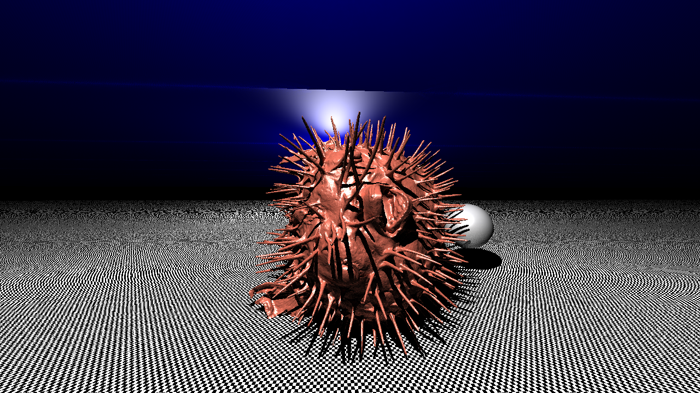

# Overview

* Projektstruktur
* Rustfeatures
* Downsides
* Lessons learned

# Projektstruktur

* Objekte und Gruppen von Objekten sind ,,Interceptable''

. . .

* Aussehen sind Shader

. . .

* Alles liegt in der ,,Welt''

. . .

* Camera : Projektion der ,,Welt''

. . .

* BVStorage : Beschleunigungsstruktur

# Projektstruktur : Interceptable Trait

## Interceptable Trait

Wir können alles rendern, was den ,,Interceptable''-Trait implementiert :

```rust
pub trait Interceptable {
    fn intercept(&self, ray: &Ray)
      -> Option<(f64, Intersection)>;
}
```

. . .

Dieser gibt an, ob, wo und wie das Objekt von einem Lichtstrahl getroffen wird.

. . .

Beispiele für ,,Interceptable'':

+ Kugeln

. . .

+ Ebenen

. . .

+ Dreiecke

. . .

+ Beschleunigungsstrukturen

---
# Projektstruktur : Shader Trait

## Shader Trait

Jeder Shader liefert eine Farbe für einen Lichtstrahl-Objekt-Schnitt.

. . .

```rust
pub trait Shader {
  fn get_appearance_for(
    &self, int_pos: Vector3<f64>, ray_dir: Vector3<f64>,
    surface_normal: Vector3<f64>, world: &World,
    uv_pos: Vector2<f64>, rec_depth: f64,
  ) -> Vector3<f64>;
}
```

. . .

Wir haben folgende Shader implementiert :

+ Monochrome shader : Nur eine Farbe

. . .

+ Diffuse shader : Diffuses Licht

. . .

+ Mirror shader : Spiegelt Licht zurück

. . .

+ Specular shader : Glanzlichter

. . .

+ Chess shader : 2 abwechselnde Shader

. . .

+ Phong shader : s. Projektbeschreibung, Kombination aus Specular, Ambient und Diffuse

# Beispiel

\begin{columns}[t]
    \column{.5\textwidth}
    \centering
    \includegraphics[height=3cm]{example-true-ambiant} \\
    \includegraphics[height=3cm]{example-mirror}
    \column{.5\textwidth}
    \centering
    \includegraphics[height=3cm]{example-mirror2}
\end{columns}

# Projektstruktur : Camera Trait

## Camera Trait

```rust
pub trait Camera {
    fn render(&self, world: &World) -> DynamicImage;
}
```

. . .

+ Equilinear Camera : ,,Normale'' Kamera
+ Equirectangular Camera : ,,360 Grad'' Kamera

# Projektstruktur : Wavefront Parser

## Wavefront Parser

3D Objekte werden als Obj-Wavefront format eingelesen und geparst.

Dafür haben wir den wavefront\_obj crate leicht verändert.

. . .


## Beispiel

\begin{columns}[t]
    \column{.5\textwidth}
    \centering
    \includegraphics[height=3cm]{example-cart} \\
    \includegraphics[height=3cm]{example-duck}
    \column{.5\textwidth}
    \centering
    \includegraphics[height=3cm]{example-blowfish}
\end{columns}

# Benutzte Rustfeatures : Operator Überladungen & Dynamic Dispatch

Um 2 Shader zu addieren:

. . .

```rust
impl Add for Box<Shader> {
    type Output = Box<Shader>;
    fn add(self, other: Box<Shader>) -> Box<Shader> {
        Box::new(AdditiveShader {
            shader1: self,
            shader2: other,
        })
    }
}
```

# Benutzte Rustfeatures : Phong Shader

## Phong Shader

Die std::ops::Add und std::ops::Mul Traits für `Box<Shader>` erleichtern das Bauen des Phong-Shader :

. . .


```rust
pub fn get_phong(color: Vector3<f64>) -> Box<Shader> {
    let diffuse_shader = DiffuseShader::new(color);
    let specular_shader = SpecularShader::new(10.0);
    let ambient_shader = AmbientShader::new(color);
    return 0.5 * diffuse_shader
        + specular_shader
        + 0.8 * ambient_shader;
}
```

# Benutzte Rustfeatures : Nalgebra und std::f64

## Nalgebra

Nalgebra ist eine Algebra-Bibliothek für Rust, die (fast) alles kann und die die Berechnung mit Vektoren vereinfacht :

. . .

* Operatoren sind für Vektoren/Matrizen überladen

. . .

* Interessante Hierarchie Struktur mit Generics :
  ```rust
type Vector3<N> = VectorN<N, U3>;
type VectorN<N, D> = MatrixMN<N, D, U1>;
type MatrixMN<N, R, C> =
    Matrix<N, R, C, Owned<N, R, C>>;
```

. . .

## std::f64

Alles was man braucht um mit floats zu arbeiten :

* Round, Log, Exp, Abs, ...

. . .

* aber auch Trigonometrische Funktionen wie cos, sin, tanh, ...
```rust
fn main() {
    println!("Hello {}!", f64::consts::PI.cos());
}
```

# Benutzte Rustfeatures : Error Handling

* Die Main kann einen `Result<T, Err>` zurückgeben

. . .

* `try!(...)` bzw `?` :
  ersetzt ein Result durch ihren Wert oder gibt den Fehler zurück

. . .


* Eigener Fehlerenum, dass die eigenen library-Fehler wrappt

  ```rust
pub enum Error {
    ParseError(wavefront_obj::ParseError),
    Io(io::Error),
    Time(std::time::SystemTimeError),
    Error(String),
}
```

# Benutzte Rustfeatures : Trait Bounds

* Für Beschleunigungsstrukturen müssen Objekte beschränkt sein, aber nicht alle Interceptable sind beschränkt
  ```rust
pub trait Bounded: Interceptable {
    fn get_min(&self) -> Vector3<f64>;
    fn get_max(&self) -> Vector3<f64>;
}
```


# Rust Downsides

+ erzwungene einheitliche Pointer : kein Vertauschen zwischen `Box<T>` und `&T` möglich

  Zum Beispiel: Um eine Box zu teilen müsste man mit `&Box<T>` arbeiten

. . .

+ Rayon : eine Library um Iteratoren zu parallelisieren

  Kompilierfehler und Dokumentation haben sich wiedersprochen

. . .

+ `cargo bench` : nur als nightly, kann nur Untercrates benchen

# Rust Downsides #2
 
```rust
trait Bounded:Interceptable { ... }
fn main() {
    let obj : Vec<Box<Bounded>> = vec![Box::new(S {})];
    let obj2 : Vec<Box<Interceptable>> = obj;
}
```

. . .

```
error[E0308]: mismatched types
 --> src/main.rs:3:42
 |
 |     let obj2 : Vec<Box<Interceptable>> = obj;
 |                                          ^^^
 | expected trait `Interceptable`, found trait `Bounded`
 |
 = note: expected type `Vec<Box<dyn Interceptable>>`
             found type `Vec<Box<dyn Bounded>>`
```

. . .

Keine ,,Upgrades'' von Trait zu Super-Traits möglich : man muss From und Into implementieren


# Rust Downsides #2

```rust
fn main() {
    let obj : Vec<Box<Bounded>> = vec![Box::new(S {})];
    //let obj2 : Vec<Box<Interceptable>> = obj;
    let obj2 : Vec<Box<Interceptable>> = from(obj);
}
impl From<Box<Bounded>> for Box<Interceptable> {
    fn from(x: Box<Bounded>) -> Self {
        Box::new(W{s:x})
    }
}
fn from(v: Vec<Box<Bounded>>) -> Vec<Box<Interceptable>> {
    let mut r: Vec<Box<Interceptable>> = Vec::new();
    for x in v {
        r.push(Box::from(x))
    }
    r
}
```

# Lessons learned

+ Structs mit Referenzen brauchen Lifetimes

. . .

+ Serde

. . .

+ Swapping mit
  ```rust
oldvalue =
std::mem::replace(&mut my_struct.var, new_value)
```

. . .

+ Konsumieren von structs
  ```rust
impl S {
    fn f(self) -> Another_S { ... }
}
```

# Fragen?


